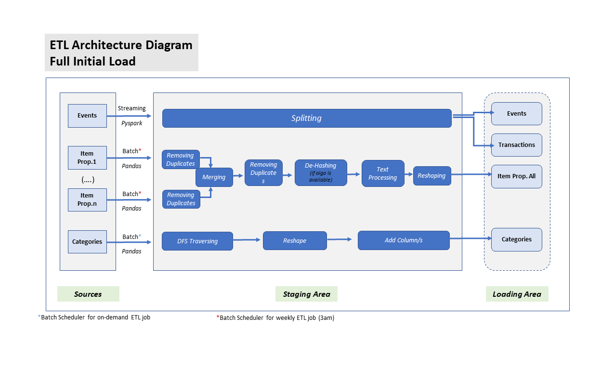
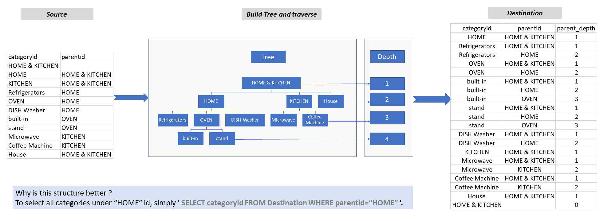
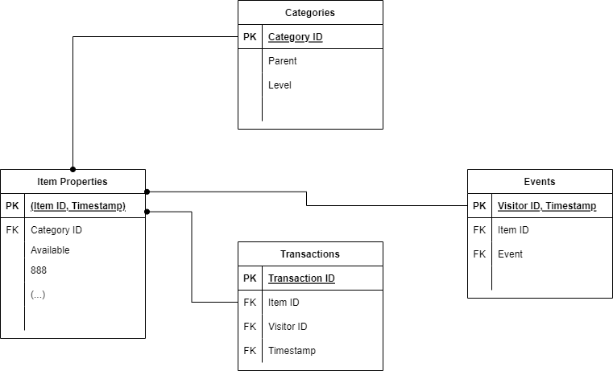

# Re-Vision Data Engineering Guidance

An ETL pipeline in the data engineering Re-Vision team.

1.[ETL Architecture](#etl-architecture-diagram)

2.[Category Tree](#category-tree)

3.[Data Model](#data-model)

4.[How to run the code](#how-to-run-the-code)

## ETL Architecture Diagram

The image above lays out the processing structure. We are going to go through an overview of why we try to adhere to this structure and will try to use the problem set  to explain how we'll apply this structure to the problem set.

The first thing to note is our tech stack. We use CSVs for data storage, our transformation logic to move data from A to B is not restricted to but normally carried out in Python or Spark. We are using batch processing in the **"Full Initial Load"** however we can use Spark streaming at **Incremental Load"**.Also the current pipeline export data to CSV we can export it to any On-demand database like MYSQL or Cloud-based like AWS redshift.

Second, The attached scripts is exist in two pictures, **.ipynb** for explanation and **.py** for running.

Third, although all scripts contain the names of files as a variable, we can pass them as Command Line Arguments.

## Category Tree

## Data Model

## How to run the code
